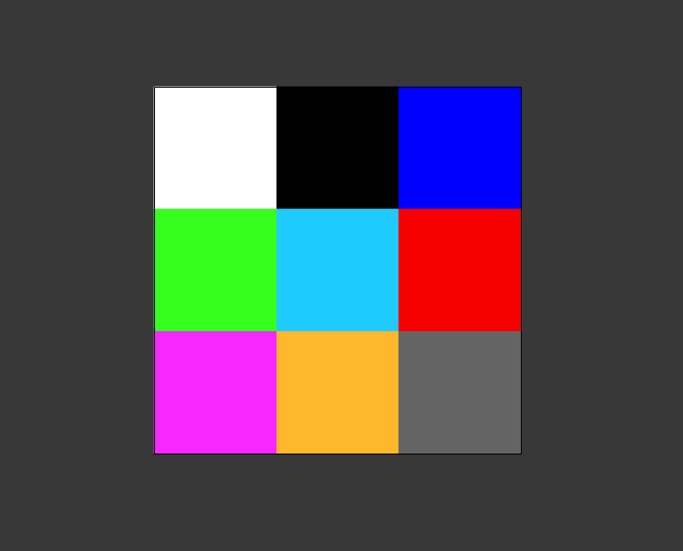

# getPixelColor

Retrieve RGB values of any PlacedItem regardless of format by parsing raw binary, all in pure scripting.

> [By request on the Illustrator forums](https://community.adobe.com/t5/illustrator-discussions/scripting-tools-to-get-the-color-of-a-particular-dot-placed-placed-on-an-image-layer/td-p/13727767)

Given any image within the Illustrator canvas, like a very ugly 3x3 pixel PNG:



Grab the RGB values of any given pixel, list of pixels, or entire image. Note that coordinates are 0-based and top-down:


## getPixelColor(pixels?: number[]|null, options?: \<Options\>)

All `options` are optional, with default values being:

```js
{
  // Function called at the very end of execution
  onComplete: null,
  // Function to modify binary data before parsing begins
  onBeforeParse: null,
  // Function to return parsed binary rawdata
  onAfterParse: null,
  BMP: {
    // File location of temporary image
    imagePath: Folder.userData + "/pixelGetColor.BMP",
    // Whether image is automatically deleted after use
    deleteImage: true,
    // File location of temporary action
    actionPath: Folder.userData + "/exportBMP.aia",
    // Whether action is automatically deleted after use
    deleteAction: true,
  },
  // Whether to return as native RGBColor or if false, as JSON
  returnColor: true,
  // Whether to return from parsing containing metadata about file such as width and height
  verbose: false,
  // Whether to remove duplicate colors
  removeDuplicates: true,
  // Whether to, if only one color is found, return the color directly instead of a 1-length array
  flattenResults: true,
}
```

## Examples using above 3x3 PNG:

### Reading a single pixel:

```js
getPixelColor([0, 1], {
  // Easily write yourself a log via lifecycle hooks:
  onAfterParse: function (result) {
    alert(result); // [{"r":53,"g":255,"b":29,"a":0}]
    // This function is not included but simple to make:
    writeFile(
      Folder.userData + "/results.json",
      JSON.stringify(result) // JSON is also not included, just for demonstration
    );
  },
});
```

### Reading multiple pixels, with additional metadata:

```js
getPixelColor(
  [
    [0, 1],
    [1, 1],
  ],
  {
    verbose: true,
    onAfterParse: function (result) {
      writeFile(
        Folder.userData + "/results.json",
        JSON.stringify(result) // JSON is also not included, just for demonstration
      );
    },
  }
);
```

```json
{
  "width": 3,
  "height": 3,
  "bpp": 4,
  "bitDepth": 32,
  "pixelData": [
    { "r": 53, "g": 255, "b": 29, "a": 0 },
    { "r": 29, "g": 203, "b": 255, "a": 0 }
  ]
}
```

### Reading every pixel of the canvas:

```js
getPixelColor(null, {
  onAfterParse: function (result) {
    writeFile(Folder.userData + "/results.json", JSON.stringify(result));
  },
});
```

```json
[
  { "r": 246, "g": 40, "b": 255, "a": 0, "x": 0, "y": 0 },
  { "r": 255, "g": 184, "b": 44, "a": 0, "x": 1, "y": 0 },
  { "r": 100, "g": 100, "b": 100, "a": 0, "x": 2, "y": 0 },
  { "r": 53, "g": 255, "b": 29, "a": 0, "x": 0, "y": 1 },
  { "r": 29, "g": 203, "b": 255, "a": 0, "x": 1, "y": 1 },
  { "r": 251, "g": 127, "b": 127, "a": 0, "x": 2, "y": 1 },
  { "r": 255, "g": 255, "b": 255, "a": 0, "x": 0, "y": 2 },
  { "r": 0, "g": 0, "b": 0, "a": 0, "x": 1, "y": 2 },
  { "r": 0, "g": 0, "b": 255, "a": 0, "x": 2, "y": 2 }
]
```

> Note the Y values here aren't correct and are inverted. This is due to BMP encoding being linear from left > right and bottom > top. Will fix this soon but running out of time on a weekday.

### Getting every color of the canvas:

```js
getPixelColor(null, {
  /* 
    Since returnColor is true by default, onComplete lifecycle acts similar to onAfterParse with the 
    exception that it processes the results (like removing duplicates and transforming to vanilla colors)
  */
  onComplete: function (result) {
    writeFile(Folder.userData + "/results.json", JSON.stringify(result));
  },
});
```

```js
[
  [RGBColor],
  [RGBColor],
  [RGBColor],
  [RGBColor],
  [RGBColor],
  [RGBColor],
  [RGBColor],
  [RGBColor],
  [RGBColor],
];
```
